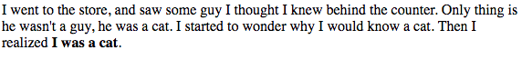
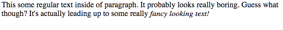
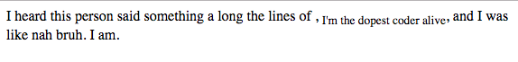
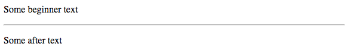

# Formatting
Text content is cool and all that, but if we want our text to have some pizzaz, we gotta use some formatting.

## Bold
```html
<b>Some text<b>
```
If you want to make some text bold, use the *b* tag:
```html
<body>
    <p>I went to the store, and saw some guy I thought I knew behind the counter. Only thing is he wasn't a guy, he was a cat. I started to wonder why I would know a cat. Then I realized <b>I was a cat</b>.</p>
</body>
```
This renders to this:


## Italic
```html
<i>Some text here</i>
```
If you want to italicize text then you use the *i* tag.

Try this out:
```html
    <body>
        <p>This some regular text inside of paragraph. It probably looks really boring. Guess what though? It's actually leading up to some really <i>fancy looking text!</i></p>
    </body>
```
This renders to this:


## Underline
```html
<u>Underlined text</u>
```
To underline text use the *u* tag. For example:
```html
    <body>
        <p>Use the underline tag when you <u>really</u> want to get a point across on something.</p>
    </body>
```
This renders to this:


## Superscript
```html
<sup>Superscript text</sup>
```
To see text in superscript form use the *sup* tag. For example:
```html
<body>
    <p>10<sup>3</sup> actually means 10 to the 3<sup>rd</sup> power.</p>
</body>
```
This renders to this:  


## Subscript
```html
<sup>Subscript text</sup>
```
To see text in subscript form use the *sub* tag. For example:
```html
<body>
    <p>I heard this person said something a long the lines of , <sub>I'm the dopest coder alive</sub>, and I was like nah bruh. I am.</p>
</body>
```
This renders to this:  


## Horizontal Rule
```html
<hr>
```
It's good to keep content seperated on screen in aesthetically pleasing ways. One of those ways is the horizontal rule. It's essentially a sideways line seperator. The *hr* tag is also not a container so you don't use a closing tag with it. For example:
```html
<body>
    <p>Some beginner text</p>
    <hr>
    <p>Some after text</p>
</body>
```
This renders to this:  


## Tag nesting
Nesting tags is when we put tags in other tags. Like when we put *h* tags inside the *body* tag. Or when we put *u* tags in side of *p* tags. You should be really careful to close your tags properly, or else you may run into some really weird issues with the way the browser renders your file.

## Stick around for the next episode...
In the next lesson we'll go into links. Links are important as they allow us to import files from across the internet to improve your own project. 