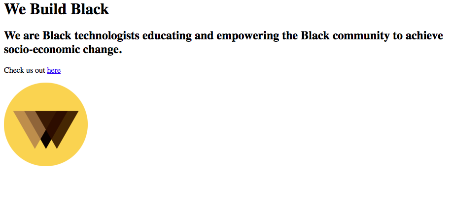

# Images
Images are a pretty slick way to add some life to your page. In certain cases they may get your point across better than words can.

## Displaying Images
```html

```
An image is created using an *img* tag like shown above. This tag is also not a container so it doesn't require a closing tag. We see there are two attributes on the tag: *src* and *alt*.

*src* stands for source and is used to define the path to the image.

*alt* stands for Alternate Text and is a quick description of the image. You don't usually see this but it's still important. Search engines use this when indexing the content on your page. This allows them to understand how relevant your page is to someone's search, then route that traffic to you.

Here's an example of an image being used:
```html
<body>
    <h1>We Build Black</h1>
    <h2>We are Black technologists educating and empowering the Black community to achieve socio-economic change.</h2>
    <p>Check us out <a href="https://webuildblack.com">here</a></p>
    
</body>
```
This renders to this:


## Image Display Size
Images have a *width* and *height* attribute that allow you to change the dimensions of the picture. We use a unit called *pixels*, which we represent with *px*, to measure things on screen. Try playing with an image and its size to see what happens. Here's an example:
```html

```

## Stick around for the next episode...
In the next lesson, we'll be talking about lists. Lists are a great way to emphasize multiple points and enhance page design. See you then!