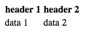
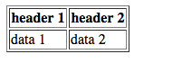
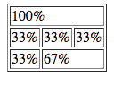
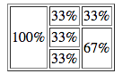

# Tables
Certain data looks better inside of a table. Maybe we need to display some data to the user.

## Displaying a table
To create a table we have to use a few different tags.
* *table* - this tag creates the overall table box
* *th*  - Stands for table header
* *td* - Stands for table data
* *tr* - Stands for table row. You put table headers or table data in here.

Let's look at a real example of a table:
```html
<body>
    <table>
        <tr>
            <th>header 1</th>
            <th>header 2</th>
        </tr>
        <tr>
            <td>data 1</td>
            <td>data 2</td>
        </tr>
    </table>
</body>
```
This renders to this:  
  
You'll notice that the table headers are emboldened to show their importance. The second thing you might notice is that there aren't any lines. We can add lines but using the *border* attribute. Add this to your table and see how it renders:  
```html
<table border="1">
```
It should look something like this:  
  

## Colspan
Colspans are used to have cells span over multiples columns. For example:
```html
<body>
    <table>
        <tr>
            <td colspan="3">100%</td>
        </tr>
        <tr>
            <td>33%</td>
            <td>33%</td>
            <td>33%</td>
        </tr>
        <tr>
            <td>33%</td>
            <td colspan="2">67%</td>
        </tr>
    </table>
</body>
```
This renders to this:  


## Rowspan
Rowspans are used to have cells span over multiples rows. For example:
```html
<body>
    <table>
        <tr>
            <td rowspan="3">100%</td>
            <td>33%</td>
            <td>33%</td>
        </tr>
        <tr>
            <td>33%</td>
            <td rowspan="2">67%</td>
        </tr>
        <tr>
            <td>33%</td>
        </tr>
    </table>
</body>
```
This renders to this:  

