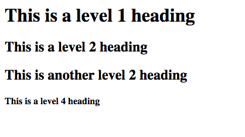
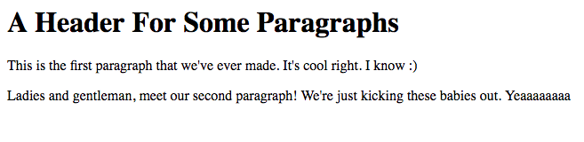

# Essays and stuff!
We're gonna start building content for our websites using the basics: text.

## Headings
Headings in HTML are made with the *h* tag. After the *h*, you must put a number to signify the level of the header.
```html
<h1>Heading goes here</h1>
```
The higher the level of the header the bigger it is. You may go down to 6 levels. It's good to use only one *h1* tag per document. Multiple *h2* and everything below is ok to have, but you should keep to a single *h1* tag for page structure.

Let's create an HTML document to see what that looks like:
```html
headings.html
<!doctype html>
<html>
    <head>
        <title>Headings Page</title>
        <meta name="description" content="Demonstrate headings">
        <meta name="keywords" content="html tutorial headings">
    </head>
    <body>
        <h1>This is a level 1 heading</h1>
        <h2>This is a level 2 heading</h2>
        <h2>This is another level 2 heading</h2>
        <h4>This is a level 4 heading</h4>
    </body>
</html>
```
This renders out to this:


## Paragraphs
```html
<p>My paragraph</p>
```
Paragraphs are created using the *p* tag. As you can see, most tags are actually a letter abbreviation of what the element they're trying to create. Try this:

```html
<body>
    <h1>A Header For Some Paragraphs</h1>
    <p>This is the first paragraph that we've ever made. It's cool right. I know :)</p>
    <p>Ladies and gentleman, meet our second paragraph! We're just kicking these babies out. Yeaaaaaaaa</p>
</body>
```

This renders to this:


## Stick around for the next episode...
Next time we'll be getting fancy with the format of our text. Things like bolding, italicizing, and underlining are in the formatting category. See you next time!