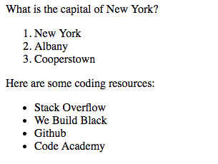
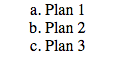
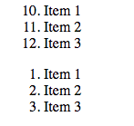
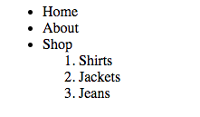

# Lists
Lists are a great tool to get some information across fairly fast. We can scan over it quickly and get the gist. In this lesson, we'll go over lists and how they can enhance the way we display content.

## Displaying a list
There are two different tyes of lists. Ordered lists:
```html
<ol>
    <li></li>
</ol>
```
And unordered lists:
```html
<ul>
    <li></li>
</ul>
```
The *li* tag stands for list item and is how we enter in list content. Let's see what these two lists look like:
```html
<body>
    <p>What is the capital of New York?</p>
    <ol>
        <li>New York</li>
        <li>Albany</li>
        <li>Cooperstown</li>
    </ol>
    <p>Here are some coding resources:</p>
    <ul>
        <li>Stack Overflow</li>
        <li>We Build Black</li>
        <li>Github</li>
        <li>Code Academy</li>
    </ul>
</body>
```
This renders out to this:  
  

We can see that the ordered lists uses ordered numbers to list out its items, while the unordered just uses dots. You can even change the list type on the *ol* using the *type* attribute. For example:
```html
<body>
    <ol type="a">
        <li>Plan 1</li>
        <li>Plan 2</li>
        <li>Plan 3</li>
    </ol>
</body>
```
This renders out to this:  
  

You can find all the ways to change a lists type [here](https://www.w3schools.com/html/html_lists.asp) at W3Schools.  

The *ol* tag also comes with two other attributes called *start* and *reversed*. *start* is used to set the number to start the list item count. *reversed* is used to reverse the order of the counting. For example:
```html
<body>
    <ol start="10">
        <li>Item 1</li>
        <li>Item 2</li>
        <li>Item 3</li>
    </ol>
    <ol reverse>
        <li>Item 1</li>
        <li>Item 2</li>
        <li>Item 3</li>
    </ol>
</body>
```
This renders this:  
  

## Nested Lists
You can even create lists within lists. Did I just blow your mind? Watch this:
```html
<body>
    <ul>
        <li>Home</li>
        <li>About</li>
        <li>Shop
            <ol reverse>
                <li>Shirts</li>
                <li>Jackets</li>
                <li>Jeans</li>
            </ol>
        </li>
    </ul>
</body>
```
This makes this:  


## Definition Lists
Definition Lists are lists that are made to create a pair of terms and definitions for those terms. To create it you use the *dl* tag, short for definition list. To create items you use the *dt* tag, short for term definition. In that term definition, you put a *dd* tag, short definition definition. It's repetitive, I know. Let's see an example:  
```html
<body>
    <dl>
        <dt>ESPN
            <dd>A sports network</dd>
        </dt>
        <dt>Google
            <dd>The Royal Family of Information</dd>
        </dt>
        <dt>We Build Black
            <dd>Something you should check out</dd>
        </dt>
    </dl>
</body>
```

## Stick sround for the next episode...
In the next lesson we'll be going over tables. We're almost at the end here. Soon you'll be able to pump out websites like a pro!